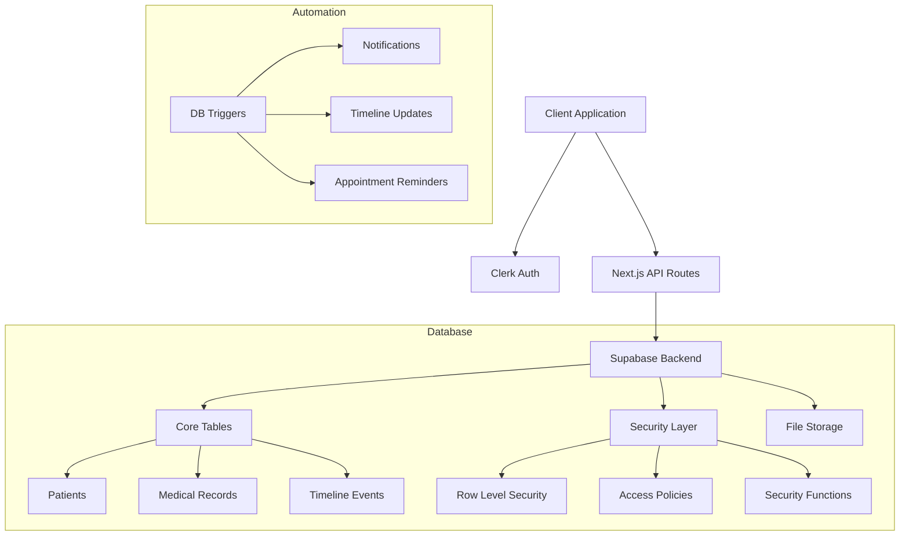
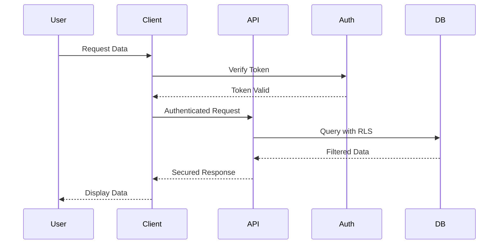
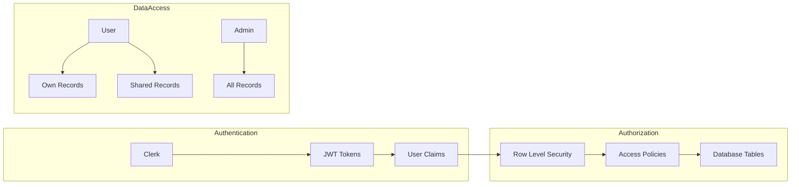
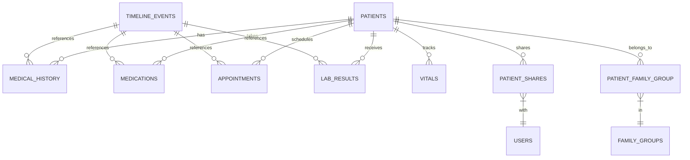

# Technical Architecture

## System Overview



## Data Flow



## Security Architecture



## Database Relations



## Security Implementation Details

### Row Level Security (RLS)

All tables implement RLS with these basic patterns:

1. Owner Access:
```sql
CREATE POLICY "Users can manage own data" ON table_name
FOR ALL USING (user_id = requesting_user_id_immutable());
```

2. Shared Access:
```sql
CREATE POLICY "Users can view shared data" ON table_name
FOR SELECT USING (
    EXISTS (
        SELECT 1 FROM patient_shares
        WHERE patient_shares.patient_id = table_name.patient_id
        AND patient_shares.shared_with_user_id::text = requesting_user_id_immutable()
        AND patient_shares.access_level = ANY (ARRAY['read', 'write', 'admin'])
        AND (patient_shares.expires_at IS NULL OR patient_shares.expires_at > now())
    )
);
```

3. Admin Access:
```sql
CREATE POLICY "Admins have full access" ON table_name
FOR ALL USING (
    EXISTS (
        SELECT 1 FROM admin_users
        WHERE admin_users.user_id::text = requesting_user_id_immutable()
    )
);
```

### Security Functions

Key security functions include:

1. User Identification:
```sql
CREATE FUNCTION requesting_user_id_immutable()
RETURNS text
LANGUAGE sql
STABLE
SECURITY DEFINER
SET search_path = public
AS $$
  SELECT COALESCE(
    current_setting('request.jwt.claims', true)::json->>'sub',
    (current_setting('request.jwt.claims', true)::json->>'email')::text
  );
$$;
```

2. Automated Timeline Updates:
```sql
CREATE FUNCTION create_timeline_event_vitals()
RETURNS trigger
LANGUAGE plpgsql
SECURITY DEFINER
SET search_path = public
AS $$
BEGIN
    INSERT INTO public.timeline_events (...)
    VALUES (...);
    RETURN NEW;
END;
$$;
``` 