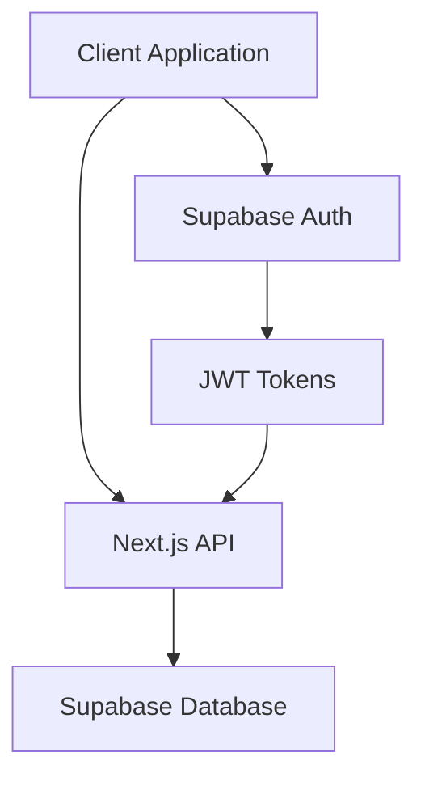

# Architecture Overview

## System Components

## Authentication Flow

1. User signs in with email/password via Supabase Auth
2. Supabase Auth returns a JWT token
3. JWT token is stored in cookies
4. Subsequent requests include the JWT token
5. Server validates JWT token and authorizes requests

## Database Schema

### Core Tables

#### users
- id (UUID, PK)
- email (string)
- created_at (timestamp)
- updated_at (timestamp)

#### patients
- id (UUID, PK)
- user_id (UUID, FK)
- name (string)
- date_of_birth (date)
- created_at (timestamp)
- updated_at (timestamp)

#### appointments
- id (UUID, PK)
- patient_id (UUID, FK)
- date (timestamp)
- notes (text)
- created_at (timestamp)
- updated_at (timestamp)

#### medical_records
- id (UUID, PK)
- patient_id (UUID, FK)
- type (string)
- content (jsonb)
- created_at (timestamp)
- updated_at (timestamp)

## Security

### Row Level Security (RLS)

All tables are protected by RLS policies:
- Users can only access their own data
- Data access is controlled by user_id relationships
- Policies are enforced at the database level

### Authentication

- Supabase Auth handles user authentication
- JWT tokens are used for session management
- Secure password hashing and storage
- Email verification for new accounts

## API Routes

### Authentication
- POST /auth/sign-up
- POST /auth/sign-in
- POST /auth/sign-out

### Patients
- GET /api/patients
- POST /api/patients
- GET /api/patients/[id]
- PUT /api/patients/[id]
- DELETE /api/patients/[id]

### Appointments
- GET /api/appointments
- POST /api/appointments
- GET /api/appointments/[id]
- PUT /api/appointments/[id]
- DELETE /api/appointments/[id]

### Medical Records
- GET /api/medical-records
- POST /api/medical-records
- GET /api/medical-records/[id]
- PUT /api/medical-records/[id]
- DELETE /api/medical-records/[id]

## Frontend Architecture

### Components
- Layout components
- Authentication components
- Patient management components
- Appointment components
- Medical record components

### State Management
- React Query for server state
- React Context for auth state
- Local state for UI components

### Routing
- Next.js App Router
- Protected routes via middleware
- Dynamic route parameters

## Development Practices

### Code Organization
- Feature-based directory structure
- Shared components and utilities
- Type definitions
- API route handlers

### Testing
- Unit tests for utilities
- Integration tests for API routes
- E2E tests for critical flows

### Performance
- Server-side rendering
- Static generation where possible
- Optimized database queries
- Caching strategies 