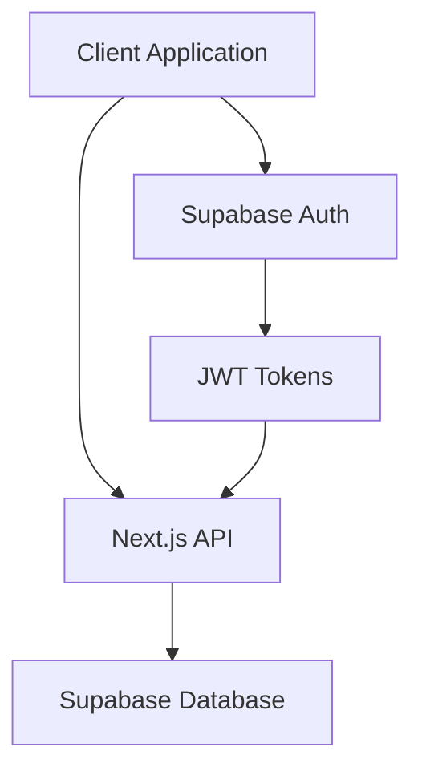

# Architecture Overview

## System Components

## Authentication Flow

1. User signs in with email/password via Supabase Auth
2. Supabase Auth returns a JWT token
3. JWT token is stored in cookies
4. Subsequent requests include the JWT token
5. Server validates JWT token and authorizes requests

## Database Schema

### Core Tables

#### users (auth.users)
- id (UUID, PK)
- email (string)
- created_at (timestamp)
- updated_at (timestamp)

#### patients
- id (UUID, PK)
- user_id (UUID, FK)
- first_name (string)
- last_name (string)
- date_of_birth (date)
- created_at (timestamp)
- updated_at (timestamp)
- deleted_at (timestamp, nullable)

#### doctors
- id (UUID, PK)
- user_id (UUID, FK)
- first_name (string)
- last_name (string)
- specialty (string)
- created_at (timestamp)
- updated_at (timestamp)

#### medical_records
- id (UUID, PK)
- patient_id (UUID, FK)
- date (timestamp)
- record_type (string)
- title (string)
- description (text)
- attachments (jsonb)
- metadata (jsonb)
- created_at (timestamp)
- updated_at (timestamp)

#### prescription_groups
- id (UUID, PK)
- user_id (UUID, FK)
- patient_id (UUID, FK)
- prescribed_by (UUID, FK to doctors)
- start_date (date)
- end_date (date, nullable)
- appointment_id (UUID, FK, nullable)
- log_id (UUID, FK, nullable)
- notes (text)
- status (enum: 'active', 'completed', 'discontinued')
- created_at (timestamp)
- updated_at (timestamp)

#### prescriptions
- id (UUID, PK)
- group_id (UUID, FK to prescription_groups)
- user_id (UUID, FK)
- patient_id (UUID, FK)
- prescribed_by (UUID, FK to doctors)
- medication (string)
- dosage (string)
- frequency (string)
- duration (string, nullable)
- refills (integer)
- notes (text, nullable)
- status (enum: 'active', 'completed', 'discontinued')
- created_at (timestamp)
- updated_at (timestamp)

#### timeline_events
- id (UUID, PK)
- patient_id (UUID, FK)
- prescription_id (UUID, FK, nullable)
- type (string)
- title (string)
- description (text)
- date (timestamp)
- metadata (jsonb)
- created_at (timestamp)

#### patient_shares
- id (UUID, PK)
- patient_id (UUID, FK)
- shared_by_user_id (UUID, FK to auth.users)
- shared_with_user_id (UUID, FK to auth.users)
- access_level (enum: 'read', 'write', 'admin')
- expires_at (timestamp, nullable)
- created_at (timestamp)

#### appointments
- id (UUID, PK)
- patient_id (UUID, FK)
- date (timestamp)
- title (string)
- notes (text)
- created_at (timestamp)
- updated_at (timestamp)

#### logs
- id (UUID, PK)
- patient_id (UUID, FK)
- date (timestamp)
- title (string)
- notes (text)
- created_at (timestamp)
- updated_at (timestamp)

## Security

### Row Level Security (RLS)

All tables are protected by RLS policies:
- Users can only access their own data
- Data access is controlled by user_id relationships and patient_shares
- Policies are enforced at the database level
- Patient sharing is controlled through the patient_shares table

### Authentication

- Supabase Auth handles user authentication
- JWT tokens are used for session management
- Secure password hashing and storage
- Email verification for new accounts

## API Routes

### Authentication
- POST /auth/sign-up
- POST /auth/sign-in
- POST /auth/sign-out

### Patients
- GET /api/patients
- POST /api/patients
- GET /api/patients/[id]
- PUT /api/patients/[id]
- DELETE /api/patients/[id]

### Medical Records
- GET /api/medical-records
- POST /api/medical-records
- GET /api/medical-records/[id]
- PUT /api/medical-records/[id]
- DELETE /api/medical-records/[id]

### Doctors
- GET /api/doctors
- POST /api/doctors
- GET /api/doctors/[id]
- PUT /api/doctors/[id]
- DELETE /api/doctors/[id]

### Prescriptions
- GET /api/prescriptions
- POST /api/prescriptions
- GET /api/prescriptions/[id]
- PATCH /api/prescriptions/[id]
- DELETE /api/prescriptions/[id]

### Appointments
- GET /api/appointments
- POST /api/appointments
- GET /api/appointments/[id]
- PUT /api/appointments/[id]
- DELETE /api/appointments/[id]

### Logs
- GET /api/logs
- POST /api/logs
- GET /api/logs/[id]
- PUT /api/logs/[id]
- DELETE /api/logs/[id]

## Frontend Architecture

### Components
- Layout components
- Authentication components
- Patient management components
- Medical records components
- Doctor management components
- Prescription management components
- Appointment components
- Log components
- Timeline components

### State Management
- React Query for server state
- React Context for auth state
- Local state for UI components
- Form state with React Hook Form

### Data Fetching Patterns
- Direct database queries for simple data
- Two-step queries for auth.users data
- In-memory data combination for complex joins
- Optimistic updates for better UX

### Forms and Modals
- Reusable form components
- Modal-based forms for complex inputs
- Form arrays for multiple items
- Rich validation with Zod schemas

### Routing
- Next.js App Router
- Protected routes via middleware
- Dynamic route parameters
- Modal-based forms within pages

## Development Practices

### Code Organization
- Feature-based directory structure
- Shared components and utilities
- Type definitions
- API route handlers
- Reusable hooks

### Testing
- Unit tests for utilities
- Integration tests for API routes
- E2E tests for critical flows
- Component testing with Jest

### Performance
- Server-side rendering
- Static generation where possible
- Optimized database queries
- Caching strategies
- Lazy loading of components 

## Type System

### Core Type Definitions
- Organized by domain in separate files
- Re-exported from central index.ts
- Strict alignment with database schema
- Separate interfaces for form data and database entities

### Database Types
- Match column types exactly (string for UUID)
- Include nullability based on database schema
- Handle relationships as optional nested objects
- Use string literal unions for enum-like types

### Form Types
- Separate from database entity types
- Include only editable fields
- Use Zod schemas for validation
- Handle complex nested structures

### Web Speech API Types
- Custom TypeScript interfaces for browser APIs
- Proper type definitions for events and instances
- Ensures type safety for speech recognition features

## Form Handling

### Form Architecture
- React Hook Form for state management
- Zod schemas for validation
- Separate types for form data
- Proper cleanup patterns for side effects

### Form Components
- Consistent prop types
- Type-safe event handlers
- Proper dependency tracking in effects
- Clear separation of concerns

### Data Submission
- Match database schema exactly
- Handle complex nested data
- Proper date/time handling
- Type-safe API calls 