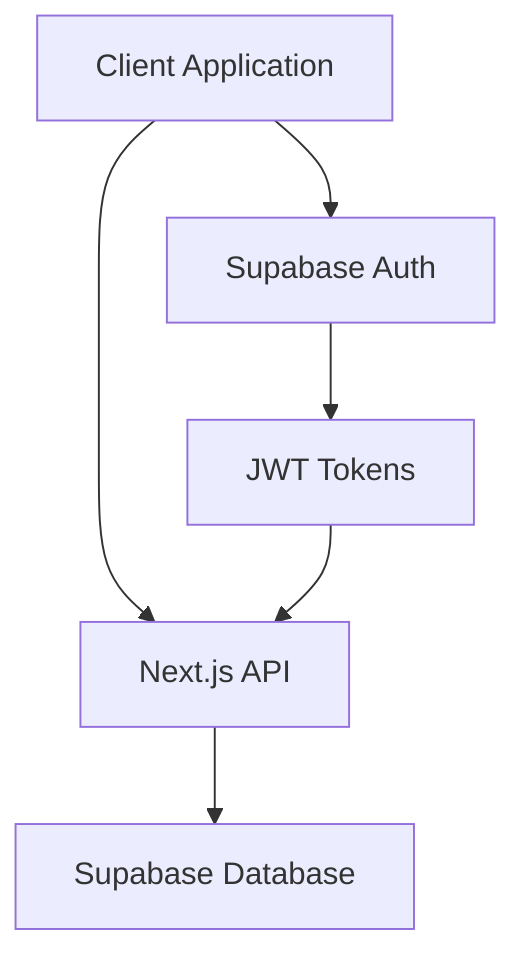

# Architecture Overview

## System Components



## Authentication Flow

1. User signs in with email/password via Supabase Auth
2. Supabase Auth returns a session with access and refresh tokens
3. Access token is stored in cookies using Supabase Auth Helpers
4. Subsequent requests include the access token automatically
5. Server validates token and authorizes requests using RLS policies
6. Token refresh is handled automatically by Supabase Auth Helpers

## Database Schema

### Core Tables

#### users (auth.users)
- id (UUID, PK)
- email (string)
- created_at (timestamp)
- updated_at (timestamp)

#### patients
- id (UUID, PK)
- user_id (UUID, FK)
- first_name (string)
- last_name (string)
- date_of_birth (date)
- created_at (timestamp)
- updated_at (timestamp)
- deleted_at (timestamp, nullable)

#### doctors
- id (UUID, PK)
- user_id (UUID, FK)
- first_name (string)
- last_name (string)
- specialty (string)
- created_at (timestamp)
- updated_at (timestamp)

#### medical_records
- id (UUID, PK)
- patient_id (UUID, FK)
- date (timestamp)
- record_type (string)
- title (string)
- description (text)
- attachments (jsonb)
- metadata (jsonb)
- created_at (timestamp)
- updated_at (timestamp)

#### prescription_groups
- id (UUID, PK)
- user_id (UUID, FK)
- patient_id (UUID, FK)
- prescribed_by (UUID, FK to doctors)
- start_date (date)
- end_date (date, nullable)
- appointment_id (UUID, FK, nullable)
- log_id (UUID, FK, nullable)
- notes (text)
- status (enum: 'active', 'completed', 'discontinued')
- created_at (timestamp)
- updated_at (timestamp)

#### prescriptions
- id (UUID, PK)
- group_id (UUID, FK to prescription_groups)
- user_id (UUID, FK)
- patient_id (UUID, FK)
- prescribed_by (string)
- medication_name (string)
- dosage_instructions (text)
- start_date (date)
- end_date (date, nullable)
- notes (text, nullable)
- status (enum: 'active', 'completed', 'discontinued')
- created_at (timestamp)
- updated_at (timestamp)

#### timeline_events
- id (UUID, PK)
- patient_id (UUID, FK)
- prescription_id (UUID, FK, nullable)
- type (string)
- title (string)
- description (text)
- date (timestamp)
- metadata (jsonb)
- created_at (timestamp)

#### patient_shares
- id (UUID, PK)
- patient_id (UUID, FK)
- shared_by_user_id (UUID, FK to auth.users)
- shared_with_user_id (UUID, FK to auth.users)
- access_level (enum: 'read', 'write', 'admin')
- expires_at (timestamp, nullable)
- created_at (timestamp)

#### appointments
- id (UUID, PK)
- patient_id (UUID, FK)
- date (timestamp)
- title (string)
- notes (text)
- created_at (timestamp)
- updated_at (timestamp)

#### logs
- id (UUID, PK)
- patient_id (UUID, FK)
- date (timestamp)
- title (string)
- notes (text)
- created_at (timestamp)
- updated_at (timestamp)

## Security

### Authentication

- Supabase Auth handles user authentication
- JWT tokens are used for session management
- Secure password hashing and storage
- Email verification for new accounts
- Row Level Security (RLS) for data access control
- Session refresh handling
- OAuth providers support
- Password reset flow
- Email templates for auth events

### Auth Flow

1. User signs in with email/password via Supabase Auth
2. Supabase Auth returns a session with access and refresh tokens
3. Access token is stored in cookies using Supabase Auth Helpers
4. Subsequent requests include the access token automatically
5. Server validates token and authorizes requests using RLS policies
6. Token refresh is handled automatically by Supabase Auth Helpers

### Security

#### Row Level Security (RLS)

All tables are protected by RLS policies:
- Users can only access their own data
- Data access is controlled by user_id relationships and patient_shares
- Policies are enforced at the database level
- Patient sharing is controlled through the patient_shares table

#### Authentication

- Supabase Auth handles user authentication
- JWT tokens are used for session management
- Secure password hashing and storage
- Email verification for new accounts
- OAuth provider integration
- Automatic session refresh
- Secure cookie handling

## API Routes

### Authentication
- POST /auth/sign-up
- POST /auth/sign-in
- POST /auth/sign-out

### Patients
- GET /api/patients
- POST /api/patients
- GET /api/patients/[id]
- PUT /api/patients/[id]
- DELETE /api/patients/[id]

### Medical Records
- GET /api/medical-records
- POST /api/medical-records
- GET /api/medical-records/[id]
- PUT /api/medical-records/[id]
- DELETE /api/medical-records/[id]

### Doctors
- GET /api/doctors
- POST /api/doctors
- GET /api/doctors/[id]
- PUT /api/doctors/[id]
- DELETE /api/doctors/[id]

### Prescriptions
- GET /api/prescriptions
- POST /api/prescriptions
- GET /api/prescriptions/[id]
- PATCH /api/prescriptions/[id]
- DELETE /api/prescriptions/[id]

### Appointments
- GET /api/appointments
- POST /api/appointments
- GET /api/appointments/[id]
- PUT /api/appointments/[id]
- DELETE /api/appointments/[id]

### Logs
- GET /api/logs
- POST /api/logs
- GET /api/logs/[id]
- PUT /api/logs/[id]
- DELETE /api/logs/[id]

## Frontend Architecture

### Core Technologies
- Next.js 14 with App Router
- React Server Components
- TypeScript
- Tailwind CSS
- Shadcn UI
- Radix UI

### State Management
- React Query for server state
- React Context for global state
- Local state with useState/useReducer
- URL state with nuqs

### Component Architecture
- Server Components by default
- Client Components when needed
- Component composition patterns
- Proper prop typing

### Performance Optimization
- React Server Components
- Image optimization
- Code splitting
- Bundle optimization

## Backend Architecture

### Core Technologies
- Next.js API Routes
- Supabase
- PostgreSQL
- Redis Cache

### Database Design
- PostgreSQL Schema
- RLS Policies
- Stored Procedures
- Database Triggers

### API Design
- RESTful endpoints
- Type-safe responses
- Error handling
- Rate limiting

### Authentication
- Clerk Authentication
- Role-based access
- Session management
- Security policies

## Infrastructure

### Hosting
- Vercel deployment
- Supabase Cloud
- AWS S3 storage
- CloudFlare CDN

### Monitoring
- Error tracking
- Performance monitoring
- Analytics
- Health checks

### Security
- SSL/TLS
- API security
- Data encryption
- Access control

### Backup
- Database backups
- File backups
- System state
- Recovery plans

## Development Environment

### Local Setup
- Node.js
- PostgreSQL
- Redis
- Development tools

### Testing
- Jest
- React Testing Library
- Cypress
- Playwright

### CI/CD
- GitHub Actions
- Automated testing
- Deployment pipeline
- Quality checks

## Code Organization

### Directory Structure
```
/app
  /(authenticated)
    /patients
    /doctors
    /appointments
  /api
  /components
  /lib
  /types
```

### Module Organization
- Feature-based structure
- Shared components
- Utility functions
- Type definitions

### Code Standards
- ESLint configuration
- Prettier formatting
- TypeScript strict mode
- Code documentation

## Data Flow

### Client-Server Communication
- API Routes
- Type-safe requests
- Error handling
- Data validation

### State Management
- Server state
- Client state
- Form state
- Cache management

### Data Persistence
- Database storage
- File storage
- Cache storage
- State persistence

## Security Architecture

### Authentication
- User authentication
- API authentication
- Token management
- Session handling

### Authorization
- Role-based access
- Permission system
- Access control
- Security policies

### Data Protection
- Encryption
- Secure storage
- Data backup
- Audit trails

## Performance Architecture

### Frontend Performance
- Code splitting
- Image optimization
- Bundle size
- Caching strategy

### Backend Performance
- Query optimization
- Connection pooling
- Rate limiting
- Load balancing

### Database Performance
- Index optimization
- Query performance
- Data partitioning
- Connection management

## Testing Architecture

### Unit Testing
- Component tests
- Service tests
- Utility tests
- Type tests

### Integration Testing
- API tests
- Flow tests
- State tests
- E2E tests

### Performance Testing
- Load testing
- Stress testing
- Benchmark tests
- Monitoring tests

## Deployment Architecture

### Build Process
- Code compilation
- Asset optimization
- Bundle analysis
- Version control

### Deployment Pipeline
- Environment setup
- Database migration
- Cache warming
- Health checks

### Monitoring
- Performance metrics
- Error tracking
- Usage analytics
- Health monitoring

## Error Handling

### Client-Side
- Error boundaries
- Form validation
- API error handling
- User feedback

### Server-Side
- API errors
- Database errors
- Service errors
- System errors

### Logging
- Error logging
- Audit logging
- Performance logging
- Security logging

## Documentation

### Technical Documentation
- API documentation
- System architecture
- Database schema
- Deployment guide

### User Documentation
- Admin manual
- User manual
- Integration guide
- Troubleshooting guide

### Development Documentation
- Code standards
- Git workflow
- Testing guide
- Release process

## Maintenance

### Regular Updates
- Dependency updates
- Security patches
- Feature updates
- Bug fixes

### Monitoring
- System health
- Performance metrics
- Error tracking
- Usage analytics

### Backup Strategy
- Database backups
- File backups
- System state
- Recovery plans
